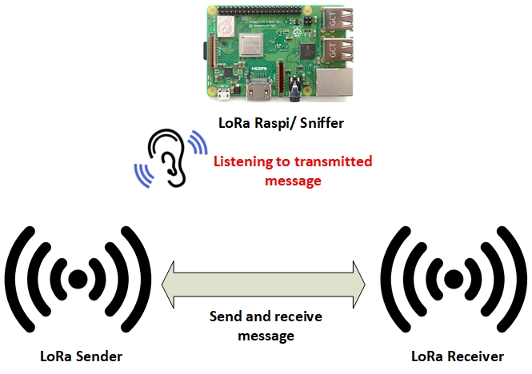

# Sniffing Prevention in LoRa Network Using Combination of Advanced Encryption Standard (AES) and Message Authentication Code (MAC)
This research presents how to prevent sniffing activity on wireless sensor network especially in LoRa networks due to the increasing use of LoRa, as well as the development of IoT devices. One of the characteristics of IoT devices is limited resources. These devices are often referred to as IoT-constrained devices. However, the limited resources possessed by IoT devices are a challenge in choosing the appropriate security method. Therefore, to overcome this problem an appropriate security method is needed namely the use of AES algorithms and MAC. Variants of AES algorithm used in this research are AES128 and AES256. Meanwhile, the MAC algorithm used is Hash-based Message Authentication Code (HMAC). Based on the results of the security analysis that has been done, this method is able to guarantee aspects of confidentiality, integrity and authentication. In addition, this study also performs overhead analysis on IoT constrained devices class 0 and class 2. The results of the overhead analysis show that this method is suitable to be implemented on IoT constrained devices class 0 and class 2.

## System Architecture
This study uses a client and server scheme. The devices on each side can be class 0 or class 2 devices that have been paired with the LoRa module. Fig. 1 is the system architecture used in this study.

Fig. 1 System Architecture

## Threat Model 
The attack model carried out in this study is eavesdropping attack. Eavesdropping is carried out through the sniffing process of messages (payload) sent via the LoRa network. In this study, the role of the Sniffer will be carried out by Raspberry pi 3 B +. Fig. 2 is an eavesdropping attack scheme.

Fig. 2 Eavesdropping Attack Scheme

## Hardware and Software 
There are several hardware and software that is used in this study, namely:
TABLE I. Hardware and Software
| No. | Name | Version |
| --- | --- | --- |
| 1 | Arduino Uno |	R3 |
| 2 | Arduino Mega | 2560 |
| 3 | Dragino LoRa | HAT |
| 4 | Raspberry Pi | 3 b+ |
| 5 | Dragino LoRa/GPS Hat for Rpi	1.4 | - |
| 6 | Arduino IDE	| 1.8.13 |

## Success Parameter
**Confidentiality**

TABLE II. 	Confidentiality Success Parameter
| No. | 	Mode	| Actual Result | 	
| --- | --- | --- |
| 1. | Without security method	| Sniffer can see the plain text |
| 2. | Using AES and MAC	| Sniffer only see the Cipher text |

**Integrity**

TABLE III. 	Integrity Success Parameter
| No. | 	Message	| Actual Result | 	
| --- | --- | --- |
| 1. | Not modified after the MAC generation process is successful |	Match |
| 2. | Modified after the MAC generation process is successful	| Unmatch |

**Authentication**

TABLE III. 	Authentication Success Parameter
| No. | 	Key	| Actual Result | 	
| --- | --- | --- |
| 1. | Same |	Match |
| 2. | Different	| Unmatch |

## Setup and Configuration
- Download and install Arduino IDE Versi 1.8.13
- Clone or download this repository to your computer
- If you want to try a code that already uses a security method, then open the code according to the method that will be carried out for each side to be tested, both the sender and the receiving side. For example, if you want to run the AES128-HMAC-SHA1 method, then open the AES and MAC folders -> AES128-HMAC-SHA1 and click the client.ino and server.ino files
- Connect constrained devices to your computer using a serial cable connected to your computer's USB
- Compile the program before uploading it to the device. Make sure there are no errors during the compilation process
- To test whether the program is running properly, open the serial monitor so that the program output can be seen clearly
- To test the security parameters for integrity and authentication, observe the output in the MAC verify section then compare the results with the success parameters listed in Success Parameter for each security parameter.
- If you want to try the Eavesdropping scenario to find out the success of the confidentiality parameters, then connect the raspberry pi with power and upload the program from the Sniffer folder to the / home raspberry pi folder
- After the file has been successfully uploaded to the / home raspi folder, then move it to the / sniffer / dragino_lora_app directory
- Run the `make` command in the terminal
- To run the sniffing process, run the command `./dragino_lora_app rec`
- To determine the success of the test, decrypt the captured data
- If you want to do an overhead analysis, observe the value that appears for each overhead component on the serial monitor when the program is running
